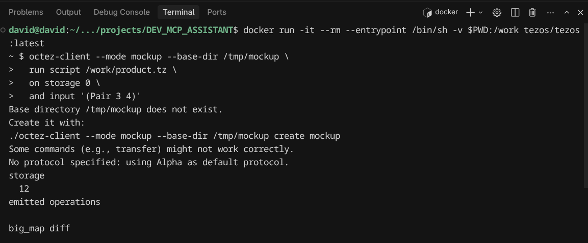

## What will we build?

An MCP server exposes **tools**, **resources**, and **prompts** to AI agents (such as Claude or Cursor) in a standardized way.

In this case, the server will give any LLM capabilities to work with Michelson:

- Parse contracts  
- Validate types  
- Explain stack instructions  

# create virtual enviroment
```python -m venv ./venv
source ./venv/bin/activate


pip install mcp fastmcp pytezos

# Run the server directly
python server.py

# Test with MCP Inspector (oficial debugging tool)
npx @modelcontextprotocol/inspector python server.py
```

|Tool               |Function                                   |
|-------------------|-------------------------------------------|
|explain_instruction|Explain any instruction Michelson          |
|explain_type       |Describe data types (int,nat,big_map,etc)  |
|run_stack_simulation| simulate stack execution step by step    |
|lint_contract | Validates against modern protocol rules (Mumbai+)|
|validate_contract   | valdate the structure basic of a contract|  
|analyze_contract|Deep analysis: bugs, warnings, anti-patterns|
|fix_contract |Suggests fixes based on common error patterns |
|improve contract |	Readability, efficiency and security suggestions|
|list_instructions   | List all instructions by category        |
|get_template        | Return ready-to-use contract templates   | 
|search_instructions |search instructions by keywords           |
|get_run_command|Generates Docker command to test a contract locally|

Live RPC Tools

|Tool	|Description      |
|-----|-----------------|
|network_info|	Current network status: block level, protocol, timestamp|
|block_info|	Info about a specific block or latest (head)|
|account_info|	Balance and info for any Tezos address|
|account_balance|	Balance in mutez and tez|
|contract_storage|	Live storage of a deployed contract|
|contract_code|	Micheline code of a deployed contract|
|contract_entrypoints|	All entrypoints and their types|
|contract_big_map|	big_map data by ID and key|
|contract_operations|	Last N transactions of a contract|
|contract_metadata	|Alias, creator and activity stats (TzKT)|
|operation_details|	Full details of an operation by hash|
|search_deployed_contracts|	Search contracts by alias or address|

Resources

| URI                      | Description                                      |
| ------------------------ | ------------------------------------------------ |
| michelson://instructions | Full instruction reference                       |
| michelson://types        | Full data type reference                         |
| michelson://cheatsheet   | Quick reference for contract structure           |
| michelson://rules        | Critical syntax rules for modern Tezos protocols |
| michelson://protocol     | Target protocol info and deprecated instructions |

Prompts
| Prompt                       | Description                                |
| ---------------------------- | ------------------------------------------ |
| explain_michelson_code       | Guides LLM to analyze a contract           |
| generate_michelson_contract  | Generates a contract from natural language |
| create_contract_from_scratch | Full contract generation with type hints   |
| fix_michelson_bug            | Diagnoses and fixes a bug                  |
| improve_michelson_code       | Optimizes an existing contract             |
| review_contract_security     | Full security audit                        |

## Networks Supported

| Network  | RPC           | Explorer             |
| -------- | ------------- | -------------------- |
| mainnet  | ecadinfra.com | api.tzkt.io          |
| ghostnet | ecadinfra.com | api.ghostnet.tzkt.io |

## Connecting to an AI Agent

Claude Desktop
Edit ~/.config/Claude/claude_desktop_config.json:


```
{
  "mcpServers": {
    "michelson": {
      "command": "absolute/path/to/venv/bin/python",
      "args": ["absolute/path/to/venv/bin/python"]
    }
  }
}
```

VS Code / Cursor
Create .vscode/mcp.json in your project root:
```
{
  "servers": {
    "michelson": {
      "type": "stdio",
      "command": "/absolute/path/to/venv/bin/python",
      "args": ["/absolute/path/to/server.py"]
    }
  }
}
```

### Testing a Contract Locally with Docker

```
docker run -it --rm --entrypoint /bin/sh -v $PWD:/work tezos/tezos:latest
```
## Testing with language michelson examples contracts

## Product
```
octez-client --mode mockup --base-dir /tmp/mockup \
  run script /work/product.tz \
  on storage 0 \
  and input '(Pair 3 4)'
```

### Substract

``` 
octez-client --mode mockup --base-dir /tmp/mockup run script /work/substract.tz on storage 10 and input '5'
```

### Addition

```
octez-client --mode mockup --base-dir /tmp/mockup run script /work/counter.tz on storage 10 and input 'Left 5'
```



